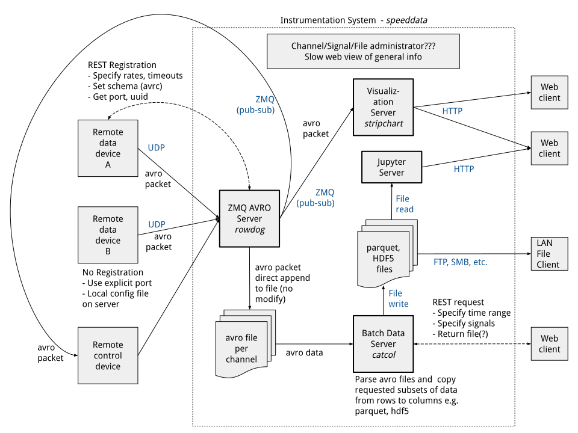

# SpeedData

SpeedData is a lightweight, ephemeral, high-performance system for receiving, batching, and visualizing data streamed over a network. The project leverages UDP multicast for low-latency communication, Avro for efficient serialization, and WebSockets for real-time updates in the browser.

**v0.5 New:** REST API for dynamic channel registration - remote devices can now register/de-register channels at runtime without editing config files.

Do you have a complex machine with a distributed control and telemetry system you would like to instrument? SpeedData makes data collection and visualization easy.

This isn't a data lake or warehouse or any of those long-term stable data relationships. This is Speed Dating for data. Data passes by on the screen pretty quickly. Make sure you figure out which data you want to set up a second date with.

#### Features
- Data is collected in real-time from all your sources and cached to disk for as long as your storage supports (based on rate, sources, and disk size)
- The latest data can be viewed on easily configurable web-pages numerically and graphically
- Data in the cache can be tagged and stored for anlysis (as a file to be moved to more durable storage)
- SpeedData can run on a Raspberry Pi on Wifi or a 16-core Xeon with quad 10Gbit Ethernet ports (collecting 10Mbps or 100Gbps respectively)


*Real-time stripcharts with multi-colored signals.*

#### Technical details
- Data is sent efficiently over the wire using UDP and Avro's encoding
- Data is re-served (with decimation) over UDP multicast to visualization systems, also very efficient
  - Zero processing makes this extremely fast and efficient for handling significant amounts of data (as much as the network will support)
- Websockets are used to update data on local web pages for ephemoral visualization
- The real-time data is effectively row-based with a persistant Avro schema
- Batches of data (time-ranges) can be rotated into column-based data for easier analysis of specific signals and stored as HDF5 files
  - The signals may be filtered, decimated, or all converted to HDF5 depending how large of a file you can tolerate

## Concepts
Data is categorized into Signals, Channels, and Sets.

A **Signal** is a single namable entity such a one or a few columns of
data. A voltage measurement might be a good example of a signal. In Avro, each
signal will be a field. In HDF5, each signal is a dataset. Naming is hard.

A **Channel** is a collection of Signals with a common abscissa e.g. time.
Voltage and current measurements at the same time interval could be two
signals in a channel. In the Avro domain, each channel has it's own schema.
In HDF5, each channel is a group

A **Set** is a collection of channels related by the range of their
abscissa. There might be a channel with a 1 Hz rate, a 1 kHz rate, and
an asynchronous channel but each start and end around the same absolute
time. Avro has no analog, as the set is a collection of disparate schema.
HDF5 will have one set per file.

## Architecture


### Directory Structure
```
speeddata/
├── config/
│   ├── agents/          # AVRO schema files for data channels
│   ├── global.yaml      # Global configuration (multicast, storage)
│   └── relay.yaml       # Relay configuration (channels, decimation)
├── relay/
│   ├── c/               # C relay implementation (v0.4)
│   │   ├── src/         # Source files (main.c, avro_writer.c, etc.)
│   │   ├── include/     # Headers (relay.h)
│   │   ├── tests/       # Unit tests
│   │   └── Makefile     # Build system
│   ├── python/          # Python relay (legacy, deprecated in v0.4)
│   ├── orchestrator.py  # Fleet manager for C relays (v0.5: with embedded REST API)
│   ├── api.py           # Flask REST API for channel registration (v0.5)
│   ├── registry_db.py   # SQLite database for channel registry (v0.5)
│   ├── README.md        # Relay documentation
│   └── API.md           # REST API documentation (v0.5)
├── stripchart/
│   ├── server/          # WebSocket server (server.js)
│   └── frontend/        # Web frontend (index.html, frontend.js)
├── pivot/python/         # Row-to-column transformer (catcol.py)
├── lib/python/          # Roelle DataSet with HDF5/AVRO loaders
├── examples/sender/     # Example data source (sender.py)
├── tests/               # Integration tests
└── Makefile             # Build system
```

### Components
1. **Source** (`examples/sender/sender.py`):
   - Example data source sending AVRO-encoded UDP packets
   - Demonstrates wire encoding with preset schema
   - One packet per time sample
2. **Relay** (`relay/c/`, v0.4):
   - High-performance C99 implementation (5Gbps per-channel throughput)
   - Per-channel process model (fault isolation)
   - Receives UDP data → writes AVRO → multicasts (full-rate + decimated)
   - Managed by Python orchestrator (`relay/orchestrator.py`)
   - **v0.5:** Orchestrator includes embedded REST API for dynamic channel registration
     - Endpoint: `http://localhost:8080/api/v1`
     - Register/de-register channels without editing config files
     - See `relay/API.md` for full API documentation
   - See `relay/README.md` for relay details
   - **Legacy:** Python relay (`relay/python/rowdog.py`) deprecated in v0.4
3. **Stripchart Server** (`stripchart/server/server.js`):
   - Subscribes to relay multicast
   - Deserializes AVRO packets
   - Publishes signals over WebSockets
4. **Stripchart Frontend** (`stripchart/frontend/`):
   - WebSocket client for live data display
   - Configured via HTML
5. **Pivot** (`pivot/python/catcol.py`):
   - Transforms row-based AVRO to column-based HDF5
   - Time-range query and signal filtering
   - Output integrates with Roelle DataSet

## Installation

### Prerequisites
- **Python 3.x**
- **Node.js**

### Clone the Repository
```bash
git clone https://github.com/roelle/speeddata.git
cd speeddata
```

### Install Dependencies
```sh
./install
```
Or use the build system:
```sh
make install
```

### Removal
Just delete the folder. Everything is local to the project.

## Usage

### Build System
```sh
make help              # Show available targets
make install          # Install dependencies
make test             # Run all tests
make validate-schemas # Validate AVRO schemas
make clean            # Remove build artifacts
```

### View Frontend
Open `stripchart/frontend/index.html` in a browser after starting the services (see Testing section).

### Load HDF5 Data
```python
from lib.python.dataset import read_hdf5

# Load SpeedData pivot output
data = read_hdf5('output.h5')

# Access channels and signals
print(data.channel['high_rate'].voltage)
print(data.voltage)  # Convenience access
```

### Configuration

**Edit Configuration Files:**
```bash
# Edit service configurations
vi config/global.yaml      # Multicast endpoints, storage paths
vi config/relay.yaml        # Channel-port mappings, rotation/retention
vi config/pivot.yaml        # API limits

# Deploy to target hosts
./config/deploy.sh
```

**Load Configuration in Python:**
```python
from lib.python.speeddata_config import load_config

# Load relay configuration
config = load_config('relay')
print(config['channels'])
print(config['multicast']['decimated'])
```

### Pivot REST API

**Query from Command Line:**
```bash
curl "http://localhost:8000/api/v1/pivot/export?start=2025-01-23T14:00:00Z&duration=PT30S&channels=example" \
  -o export.h5
```

**Query from Python/JupyterLab:**
```python
import requests
from lib.python.dataset import read_hdf5

# Request HDF5 export via REST API
response = requests.get('http://localhost:8000/api/v1/pivot/export', params={
    'start': '2025-01-23T14:00:00Z',
    'duration': 'PT1M',
    'channels': 'example'
})

# Save and load
with open('export.h5', 'wb') as f:
    f.write(response.content)

data = read_hdf5('export.h5')
print(data.example.voltage)
```

**Start Pivot API Server:**
```bash
python pivot/python/api_server.py
# Server runs on http://localhost:8000
```

### Load AVRO Data Directly

```python
from lib.python.dataset import read_avro

# Load AVRO file from relay storage
data = read_avro('/var/speeddata/avro/example_20250123.avro')

# Access signals (same API as HDF5)
print(data.example.voltage)
print(data.example.time)
```

### Stripchart Visualization

**Add Charts to HTML:**
```html
<!-- Single signal with explicit Y-axis range -->
<canvas class="stripchart"
        data-signals="example.sine_wave"
        data-window="60"
        data-height="300"
        data-ymin="-1.2"
        data-ymax="1.2"
        data-theme="auto">
</canvas>

<!-- Multiple signals with auto-assigned colors -->
<canvas class="stripchart"
        data-signals="example.sine_wave,example.ramp,example.square_wave"
        data-window="60"
        data-height="400"
        data-ymin="-1.5"
        data-ymax="1.5"
        data-theme="auto">
</canvas>

<!-- Custom color override -->
<canvas class="stripchart"
        data-signals="example.sine_wave,example.ramp"
        data-colors="#FF0000,#00FF00"
        data-window="60"
        data-height="300"
        data-theme="auto">
</canvas>
```

**Configuration Options:**
- `data-signals`: Comma-separated signal names (e.g., "example.voltage,example.current")
- `data-window`: Time window in seconds (default: 30)
- `data-height`: Canvas height in pixels (default: 300)
- `data-ymin`, `data-ymax`: Explicit Y-axis range (optional, auto-scales if omitted)
- `data-colors`: Custom colors as hex codes (optional, auto-assigns if omitted)
- `data-theme`: "auto", "dark", or "light"

**Color Palettes:**
- Dark mode: Yellow, Cyan, Magenta, Green, Orange, Light Red
- Light mode: Blue, Red, Green, Orange, Purple, Teal
- Override with `data-colors="#FF0000,#00FF00,#0000FF"` for custom colors

### JupyterLab Analysis

JupyterLab provides interactive data analysis for SpeedData with live data loading, tagging, and visualization.

**Launch JupyterLab:**
```bash
# From project root with activated virtual environment
source bin/activate
jupyter lab
```

**Complete Workflow:**

1. **Load Live Data from Pivot API:**
```python
import sys
sys.path.insert(0, 'lib/python')

import requests
from dataset import read_hdf5
from datetime import datetime

# Query last 30 seconds of data
response = requests.get('http://localhost:8000/api/v1/pivot/export', params={
    'start': datetime.now().isoformat() + 'Z',
    'duration': 'PT30S',
    'channels': 'example'
})

# Save and load HDF5
with open('live_export.h5', 'wb') as f:
    f.write(response.content)

data = read_hdf5('live_export.h5')
print(data)
```

2. **Load Historical AVRO Data:**
```python
from dataset import read_avro

# Load directly from relay storage
data = read_avro('./data/data_1234567890.avro')
print(data.example.sine_wave)
```

3. **Plot Time-Series Data:**
```python
import matplotlib.pyplot as plt

fig, axes = plt.subplots(4, 1, figsize=(12, 10), sharex=True)

# Plot each test signal
axes[0].plot(data.example.time, data.example.sine_wave, 'b-')
axes[0].set_ylabel('Sine Wave')
axes[0].grid(True)

axes[1].plot(data.example.time, data.example.ramp, 'r-')
axes[1].set_ylabel('Ramp')
axes[1].grid(True)

axes[2].plot(data.example.time, data.example.square_wave, 'g-')
axes[2].set_ylabel('Square Wave')
axes[2].grid(True)

axes[3].plot(data.example.time, data.example.noise, 'k-', alpha=0.5)
axes[3].set_ylabel('Noise')
axes[3].set_xlabel('Time (s)')
axes[3].grid(True)

plt.tight_layout()
plt.show()
```

4. **Tag Interesting Data Segments:**
```python
# Identify time range of interest from plots
t_start = data.example.time[100]  # Example: sample 100
t_end = data.example.time[200]    # to sample 200

# Export tagged segment via Pivot API
tagged_response = requests.get('http://localhost:8000/api/v1/pivot/export', params={
    'start': datetime.fromtimestamp(t_start).isoformat() + 'Z',
    'duration': f'PT{int(t_end - t_start)}S',
    'channels': 'example'
})

# Save tagged segment for durable storage
with open(f'tagged_event_{int(t_start)}.h5', 'wb') as f:
    f.write(tagged_response.content)

print(f"Tagged segment saved: tagged_event_{int(t_start)}.h5")
```

5. **Statistical Analysis:**
```python
import numpy as np

# Analyze signal statistics
print("Sine Wave Statistics:")
print(f"  Mean: {np.mean(data.example.sine_wave):.4f}")
print(f"  Std:  {np.std(data.example.sine_wave):.4f}")
print(f"  Min:  {np.min(data.example.sine_wave):.4f}")
print(f"  Max:  {np.max(data.example.sine_wave):.4f}")

# FFT analysis for frequency content
from numpy.fft import fft, fftfreq
fft_result = fft(data.example.sine_wave)
freqs = fftfreq(len(data.example.sine_wave), 1.0)  # Assuming 1Hz sample rate

plt.figure(figsize=(12, 4))
plt.plot(freqs[:len(freqs)//2], np.abs(fft_result[:len(freqs)//2]))
plt.xlabel('Frequency (Hz)')
plt.ylabel('Magnitude')
plt.title('FFT of Sine Wave')
plt.grid(True)
plt.show()
```

**Example Notebook:**
- Open `examples/jupyter/speeddata_analysis_example.ipynb` for a complete walkthrough
- Demonstrates Pivot API usage, data loading, plotting, and analysis

## Testing

### Quick Integration Test

**Prerequisites:**
```bash
# Install dependencies (if not already done)
make install
# OR
./install

# Activate virtual environment
source bin/activate
```

**Step 1: Build C Relay (v0.4)**
```bash
# Build C relay binary
cd relay/c
make
cd ../..
```

**Step 2: Start Services**
```bash
# Terminal 1: Start example data sender
python examples/sender/sender.py

# Terminal 2: Start relay orchestrator (manages C relay processes)
python relay/orchestrator.py
# OR use Python relay (deprecated):
# python relay/python/rowdog.py

# Terminal 3: Start stripchart WebSocket server
cd stripchart/server
node server.js

# Terminal 4: Start Pivot API server (optional)
python pivot/python/api_server.py
```

**Step 3: View Live Visualization**
```bash
# Open stripchart frontend in browser
open stripchart/frontend/index.html
# Or navigate to: file:///path/to/speeddata/stripchart/frontend/index.html

# You should see:
# - Latest values updating every second
# - Scrolling stripcharts with live data
# - Dark/light mode based on system preference
```

**Step 4: Test Pivot API (optional)**
```bash
# Query HDF5 export via REST API
curl "http://localhost:8000/api/v1/pivot/export?start=2025-01-23T14:00:00Z&duration=PT30S&channels=example" \
  -o test_export.h5

# Verify HDF5 file created
ls -lh test_export.h5

# Load in Python
python -c "from lib.python.dataset import read_hdf5; data = read_hdf5('test_export.h5'); print(data)"
```

**Step 5: Test Configuration**
```bash
# Test config loader
python -c "from lib.python.speeddata_config import load_config; print(load_config('relay'))"

# Verify config files
ls -l config/*.yaml
```

### Run Automated Tests

```bash
# Run all tests
make test

# C relay tests (v0.4)
cd relay/c/tests && make test           # Unit tests (AVRO encoding, decimation, writer)
cd ../.. && python3 tests/test_relay_integration.py   # Integration tests (UDP → AVRO → multicast)
python3 tests/test_full_system.py       # Full system test (agent → relay → AVRO + multicast)

# Python tests
pytest lib/python/tests/                # Library tests
pytest tests/                           # Integration tests

# Run specific tests
pytest lib/python/tests/test_dataset_hdf5.py  # HDF5 loader tests
pytest tests/test_api_burst.py                 # Pivot API burst tests
```

### Expected Test Results

**C Relay (v0.4):**
- ✓ 9 tests in `relay/c/tests/` (utils, decimator, AVRO writer)
- ✓ 3 tests in `tests/test_relay_integration.py` (UDP → AVRO → multicast)
- ✓ 1 test in `tests/test_full_system.py` (end-to-end data flow)

**Python:**
- ✓ 8 tests in `lib/python/tests/test_dataset_hdf5.py` (HDF5 loading)
- ✓ 3 tests in `tests/test_api_burst.py` (API burst handling)

**Integration:**
- ✓ All services start without errors
- ✓ Stripchart displays live scrolling data
- ✓ Pivot API returns valid HDF5 files

### Troubleshooting

**Services won't start:**
```bash
# Check if ports are in use
lsof -i :26000  # Sender
lsof -i :26001  # Relay
lsof -i :8080   # Stripchart WebSocket
lsof -i :8000   # Pivot API

# Kill processes if needed
pkill -f sender.py
pkill -f rowdog.py
pkill -f server.js
pkill -f api_server.py
```

**No data in stripchart:**
- Check browser console for WebSocket errors
- Verify sender is running: `ps aux | grep sender.py`
- Verify stripchart server is running: `ps aux | grep server.js`
- Check WebSocket connection: Open browser DevTools → Network → WS

**Pivot API errors:**
- Check if server is running: `curl http://localhost:8000/api/v1/health`
- Verify AVRO files exist: `ls -l /var/speeddata/avro/` (or configured path)
- Check server logs for errors

## Roadmap

### v0.1 - January 2025 ✓
- Proof-of-concept, not real functionality
- Basic end-to-end functionality
- Example source, relay, pivot, and web visualization

### Current Release - v0.3
- ✓ Service-oriented architecture (relay, stripchart, pivot as independent processes)
- ✓ Folder structure: config/, relay/, stripchart/, pivot/, lib/, examples/
- ✓ Build system (Makefile with install, test, validate-schemas targets)
- ✓ Test framework (pytest with 8 passing tests)
- ✓ HDF5 loader for Roelle DataSet (`read_hdf5()`, `Set.from_hdf5()`)
- ✓ AVRO schema configuration in config/agents/
- ✓ Updated paths for new directory structure

### Features
- ✓ **Pivot REST API**: Simple synchronous GET endpoint for AVRO→HDF5 transformation
  - Time specification: ISO 8601 timestamps and durations (e.g., `PT30S`)
  - Channel/signal selection via query parameters
  - `/api/v1/pivot/export?start=<ISO8601>&duration=<ISO8601>&channels=<list>`
  - Limits: 20 channels max, 5 minutes max duration
- ✓ **Configuration System**: Per-service YAML files with git-based deployment
  - `config/global.yaml`: Shared settings (multicast endpoints, storage paths)
  - `config/relay.yaml`: Channel-port mappings, rotation/retention policies
  - `config/stripchart.yaml`: WebSocket settings
  - `config/pivot.yaml`: API limits and settings
  - `config/deploy.sh`: Deployment script for multi-machine sync
  - Python config loader: `speeddata_config.load_config(service_name)`
- ✓ **Relay-Side Decimation** (FPF Decision: DRR-2025-12-23-relay-side-decimation-with-dual-multicast)
  - Dual multicast: full-rate (archival) + decimated (visualization)
  - Configurable decimation factor and algorithm (downsample, average, min-max, RMS)
  - Zero processing overhead for full-rate stream
- ✓ **Stripchart Visualization** (FPF Decision: DRR-2025-12-23-lightweight-canvas-stripchart)
  - Real-time scrolling time-series charts (Canvas + Vanilla JavaScript)
  - Zero npm dependencies (~5 KB implementation)
  - Configurable time window (FIFO queue behavior)
  - Dark/light mode CSS theming
  - Multi-chart pages with per-chart signal selection
  - `<canvas class="stripchart" data-signals="ch1.voltage" data-window="30">`
- ✓ **AVRO DataSet Loader**: Direct AVRO file loading for offline analysis
  - `read_avro('relay_data.avro')` convenience function
  - `Set.from_avro(file_path, schema_path, channel_name)` method
  - Integrates with Roelle DataSet for consistent API
- ✓ **JupyterLab Integration**: Example notebooks for analysis workflows
  - `examples/jupyter/speeddata_analysis_example.ipynb`
  - Demonstrates Pivot API usage, DataSet loading, plotting, analysis 

### v0.4 - In Progress
- ✓ **Port relay to compiled language** (FPF Decision: DRR-2025-12-24-v0-4-relay-architecture-c-stdio-per-channel-revised)
  - C99 implementation with 5Gbps per-channel throughput
  - Per-channel process model (fault isolation)
  - Python orchestrator for fleet management
  - Comprehensive testing (unit + integration + full system)
  - See `relay/README.md` for details
- [ ] Investigate larger data objects in HDF5 files for better compression (would change storage format)
- [ ] Create a status and control website (registration, channels, signals etc.)
- [ ] Add channel registration (via REST)

### v0.5 - May 2025
- Firm interfaces
- Add docuemntation
- Choose a License

### v0.6 - June 2025
- dockerize
- Split apps into repositories (speeddata: relay, stripchart, pivot)
- Build docker container for 

### v0.7 - July 2025
- Start using git issues to track improvements and roadmap
- Optimize a build and tune for a Raspberry Pi and provide instructions for use

### v0.8 - August 2025

### v0.9 - September 2025

### v1.0 - October 2025

### v2.0

## Contributing
Contributions are dubious at the moment while the architecture is in flux.
If you want to participate, reach out to the maintainer, roelle, for a
discussion.

## License
TBD - Subject to change (will be open, not GPL)